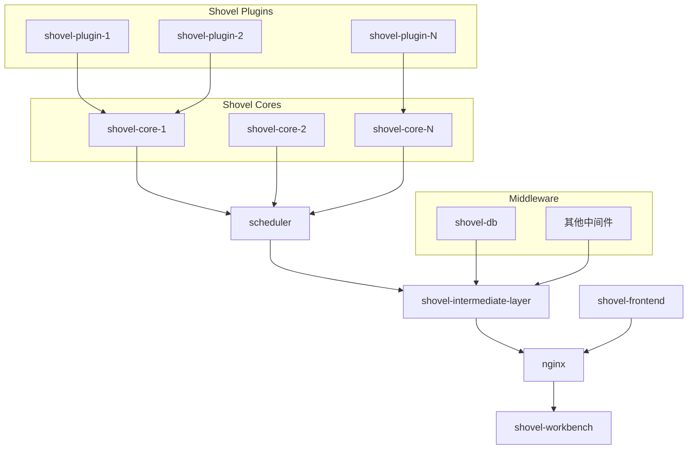

# DIAMOND SHOVEL-WORKBENCH

shovel-workbench是基于[diamond-shovel](https://github.com/diamond-shovel/diamond-shovel)框架制作的外围WEB-UI项目

它能使用户快速的按场景部署任务流，从而稳健建设的私有化资产管理体系。

## WIKI

WIKI请见[diamond-shovel-wiki](https://diamond-shovel.github.io/shovel-wiki/)

## Project Structure

